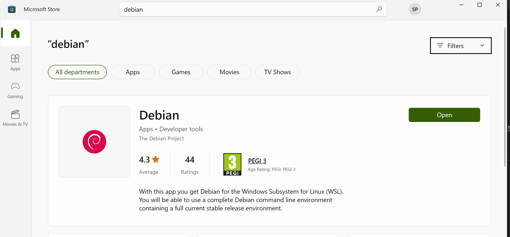
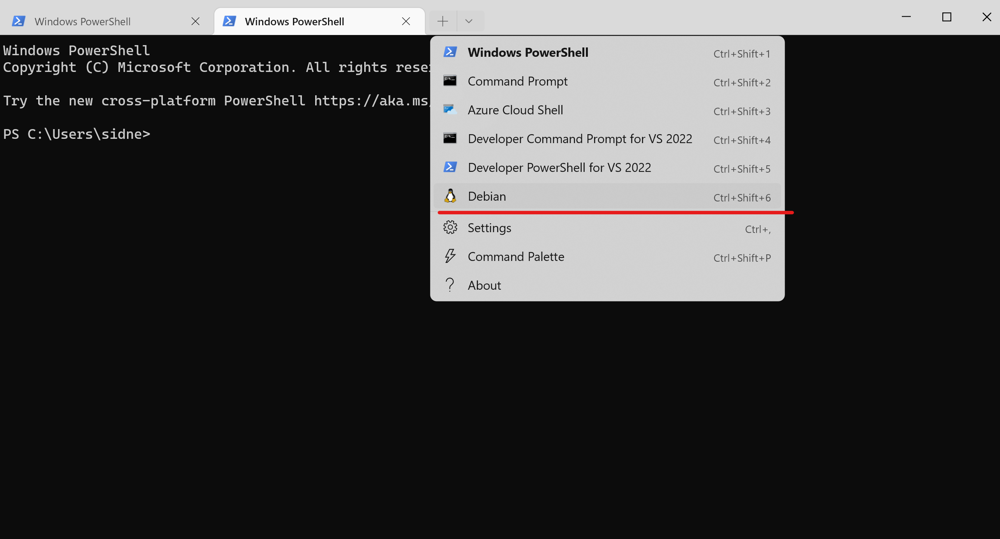
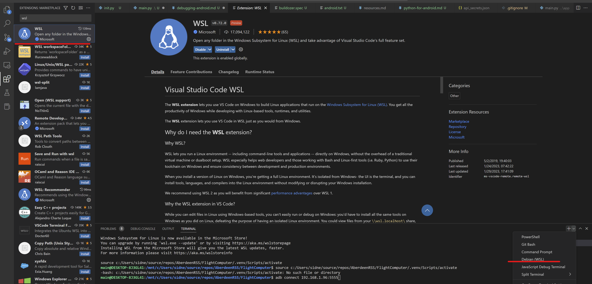
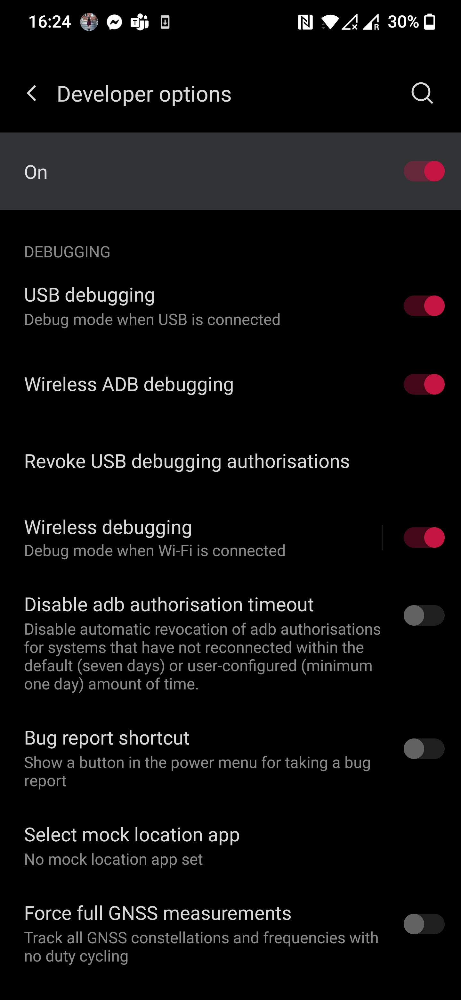
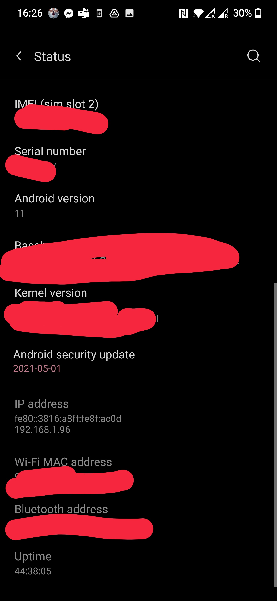

# Testing and running the flight computer

First it should be noted that the application runs on the desktop as well. You can just use `python main.py` to launch it
and it works like any other application. You should even see some preview UI output. Note however that all the android
native functionality (accelerometer, gps, etc.) won't be available. We are trying to build the application such that
it doesn't crash when that stuff is not there or to even return some dummy values. This is because launching the 
app on the phone takes some time and it is hard to find out where bugs are coming from (way easier to test on the
desktop)

# Launching the thing on you phone
With all that said, lets go into how to launch the application on an android phone.

## 1. Setup WSL
Unfortunately the build tools for android that we need to use only run on linux. Luckily there is now WSL
a quite seamless virtual machine for windows (Linux will run within windows and you can simply run commands
within linux from a normal windows terminal). To activate it follow the steps [here](https://learn.microsoft.com/en-us/windows/wsl/install)

Then install a specific version of linux on you WSL. This can be done through the windows store. Just search for it (here debian) and
install it:

(Please use debian or ubuntu, if you are not familiar with linux yet)

It will then show up in your terminal as such:

It's also recommended to install the VSCode extension for WSL: 

this will allow you to directly run things in the WSL from VS Code

## 2. Install Bulldozer on your WSL

Follow the steps [here](https://kivy.org/doc/stable/guide/packaging-android.html#packaging-android) until you reach
the command `buildozer android debug deploy run` (don't execute yet). Note that this involves some knowledge of
how to get around a linux command line. If you have never done this ask someone in the society with experience
in linux (Currently Sidney or Andrew).

## 3. Prepare you android device

1. You need to enable the developer mode on your phone: https://www.lifewire.com/how-to-enable-developer-mode-on-android-4684044
2. Make sure your phone is connected to the same local network as your computer. This is needed so you computer can send the app directly to your phone. Note that this might not work if you are on a public wifi, like the school's. What should work is setting up a hotspot from your android device and then connecting over that.
3. Enable wifi debugging on your phone. To do so enable the following setting in the developer menu (found in your phone's settings after enabling developer mode):

## 4. Connect to your android device from the wsl
First you need to find out your phone's current ipv4 address. This can be done by looking into the phone's status
in the settings (might be different on you device):

   
Now go into your wsl and connect your device through the `adb` command
Further instructions on this can be found here: https://developer.android.com/studio/command-line/adb#wireless

## 5. Deploy your app
Run `buildozer android debug deploy run` within this repositorie's directory (while at the same file path as the FlightComputer code).   
NOTE: don't run the command with the files being in windows. Clone the repo in linux and then run things there. Otherwise the build might take up to 100x as long   

When it's done your phone should automatically open the app. You'll also see the app in your "All apps" menu on your phone. It can be use like any other app from that point on